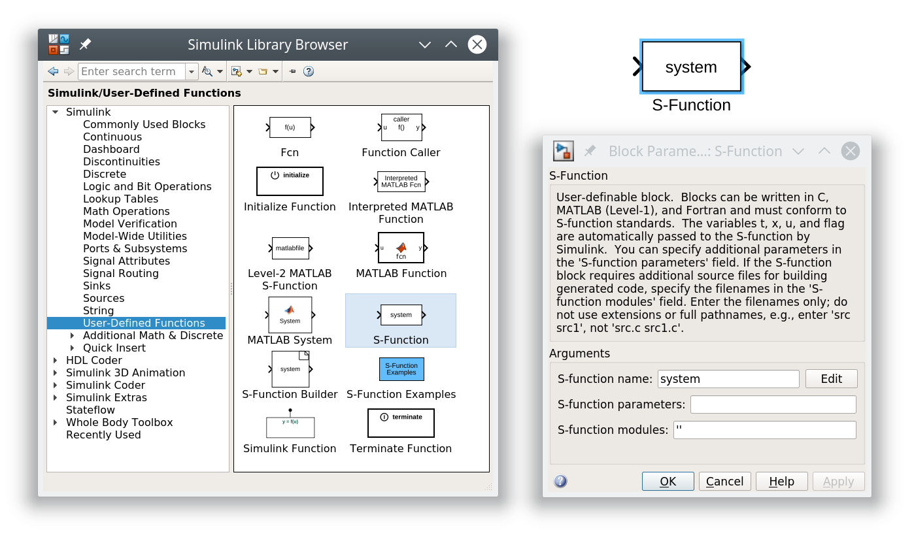
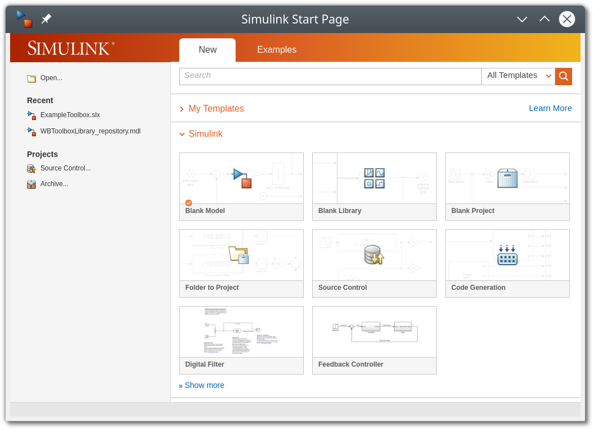
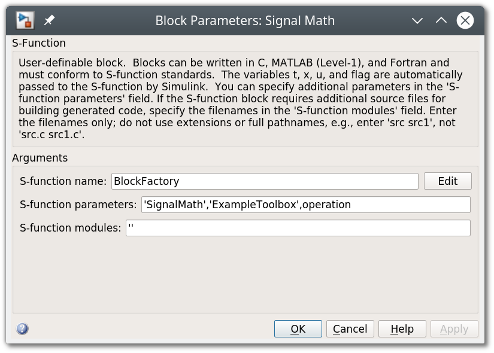
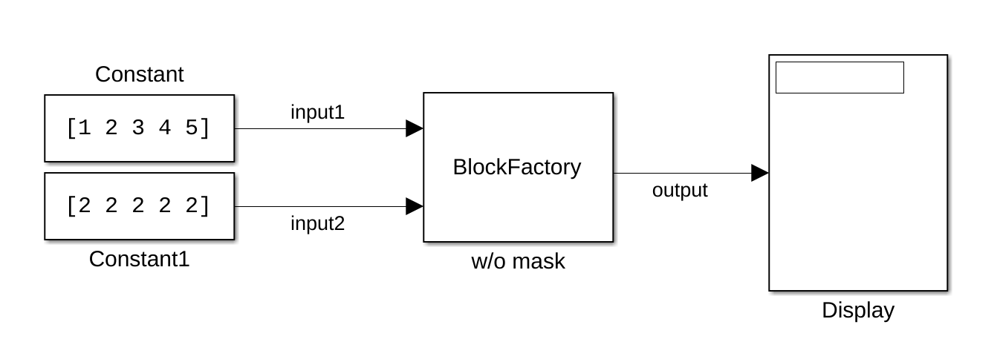
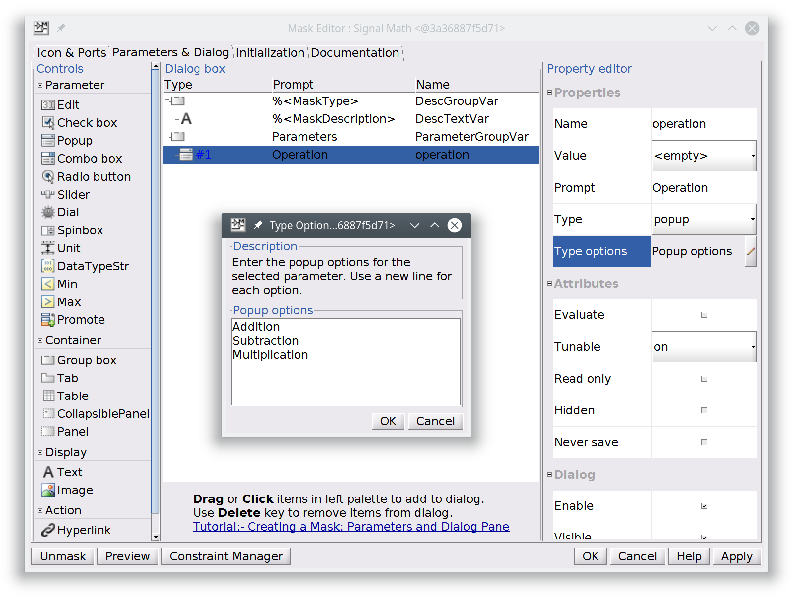

# How to create a new library

This guide describes how to use BlockFactory for creating a new toolbox **Toolbox Example**. It will contain a single block _Signal math_ with the following specifications:

- Accepts two input signals
- Performs element-wise operations: sum, subtraction, multiplication
- Allows to select the operation with a user friendly GUI (mask)
- Produces an output signal with the result of the operation

Despite it is a very trivial example, it shows how to structure both the C++ and the Matlab components of a toolbox. From this starting point is then possible to build more complex architectures which might need e.g. to be split in many parts or to link against third-party libraries.

!!! example "Toolbox Example project"
    You can find the files of this example in the [`example`](https://github.com/robotology/blockfactory/tree/master/example) folder.

## Introduction

Before jumping in the example of this tutorial, in this section you will find helpful information useful to grasp the key ideas about the toolbox and a refreshing of common terms and patterns used in programming.

### Algorithm specifications

The execution of a generic algorithm can be split in the following basic phases:

1. Configuration
2. Initialization
3. Step
4. Termination

In the configuration phase the algorithm can, for instance, read parameters and specify details about its inputs and outputs. During the initialization it might need to allocate resources. When everything is ready, the simulation starts and on every cycle of the loop the algorithm computes a step. Before finishing the simulation, in the termination step the resources that are not anymore needed can be deallocated and final operations can be executed.

### Terminology

There are few key components which are part of the core infrastructure, and it is important they are clear from the very beginning.

!!! note
    This project has strong roots with Simulink. Despite it is not anymore strictly related to it, the structure keeps as inheritance its terminology.

#### Block

The Block is the main component of the toolbox. You may think of it as a wrapper for a generic algorithm. It provides support of all the phases discussed above.

#### Port

Blocks need to interface with the outside for reading input data and writing their results. Ports are attached to the Block and let data flow in and out from it. They have properties like the accepted data type and they are characterized by a size.

#### Signal

A Signal is the generalization of a buffer. It can be plugged to multiple Ports and allows sharing data between them. Similarly to Ports, a Signal has a data type and a width. When a Signal is connected to a Port, their dimension must match.

#### Engine

The engine is the framework that calls and executes the code implementing the Blocks. We currently provide support for Simulink and Simulink Coder. Alternative engines might be Scilab or even standalone C++ code.

#### BlockInformation

BlockInformation is the interface between a Block and the engine that executes its code. Despite blocks are not aware of what engine is executing them, blocks and engine need to exchange information such as user parameters and Port data. BlockInformation provides methods for setting and getting this piece of information.

#### Simulink Block

A Simulink Block is the wrapper of a (C++) Block. It provides a visual representation of it, with input and output ports and gives the possibility to connect it with other Simulink blocks through signals. The terms above come from this representation and map it to C++.

#### Simulink Model

A Simulink Model is a project composed of a set of Simulink Blocks interconnected by Signals.

#### Simulink Library

A Simulink Library is a container of a set of Blocks that populates the _Simulink Library Browser_. Every toolbox must be shipped with an associated Simulink Library file in order to expose its Blocks.

#### S-Function

There are many types of functions for implementing an algorithm wrapped by a Simulink Block. In Matlab terminology, these functions are referred as [S-Functions](https://it.mathworks.com/help/simulink/sfg/what-is-an-s-function.html). You can read more about the supported types in [What type of S-Function should you use](https://it.mathworks.com/help/simulink/sfg/what-type-of-s-function-should-you-use.html).

In short S-Functions provide a sort of interface (through C callbacks) where a given number of functions need to be implemented. Simulink knows the name of these functions and calls them on demand.

#### Block Mask

A Simulink Block is just a square with input and output ports. It is possible to "mask" a Simulink Block in order to provide a user-friendly GUI that can be useful e.g. for setting Block parameters. The mask may contain buttons, sliders, check boxes, dropdown menus, etc.

#### Software library

A library is a file containing compiled code (functions, classes, constants, etc.) which cannot be executed standalone. It can be either _static_ or _dynamic_. Static libraries are meant to be embedded inside the executable that calls their symbols, instead the code of dynamic libraries (also called shared libraries) is only referenced inside the executable and called when needed.

To grasp better this difference, if multiple executables link against the same static library, the same code is embedded inside all of them, resulting in bigger executables and code duplication. A dynamic library object instead can be shared by multiple executables that need only to know its location in the filesystem and which symbols it provide.

!!! info
    You can find more detailed information about software libraries and linkers at [this link](https://www.lurklurk.org/linkers/linkers.html).

#### Plugin Library

A plugin library is a particular type of a dynamic library. An executable can load dynamic libraries either at load time, i.e. when the executable is launched, or at run time, i.e. when needed during the execution. The libraries that can be loaded during run time are referred as plugins.

!!! info
    On UNIX systems the load of a plugin is executed by a `dlopen` call

### Overview of Simulink execution

BlockFactory provides a framework capable of loading during runtime shared libraries (plugins). When the Simulink simulation starts, its engine assigns a deterministic order to the blocks of the Simulink Model. If one of these blocks is not contained in the default toolboxes provided by Mathworks, it needs to be associated to a _S-Function_ that implements its logic. The toolbox provides a streamlined approach to implement these functions without the need of being an expert of the complex Simulink APIs.

The blocks of our library are implemented in Simulink using the following _S-Function_ block:



For the time being, what you need to know is that the name of the plugin library generated from the C++ code will be stored in the _S-function parameters_ field of the block mask. We provide a generic **Level-2 MEX S-Function** that reads this parameter and uses the library name name to dynamically load the dynamic library that contains the block's code.

After the library is found in the filesystem and successfully loaded, Simulink allocates an object of the C++ class associated to the block functionality. Again, this information (the class name) is passed in the _S-function parameters_ field of the block mask.

## Develop the C++ plugin

You already learned that Blocks are no more than regular C++ classes. They are not an exception, in fact all the components discussed until now are mapped to C++ classes or interfaces ([abstract classes](https://en.cppreference.com/w/cpp/language/abstract_class)).

The following resources provide further information about them:

- Blocks are implementations of the [`blockfactory::core::Block`](https://robotology.github.io/blockfactory/doxygen/classblockfactory_1_1core_1_1_block.html) interface
- BlockInformation is defined in the  [`blockfactory::core::BlockInformation`](https://robotology.github.io/blockfactory/doxygen/classblockfactory_1_1core_1_1_block_information.html) interface
- Signals are mapped to the [`blockfactory::core::Signal`](https://robotology.github.io/blockfactory/doxygen/classblockfactory_1_1core_1_1_signal.html) class
- Blocks parameters are mapped to the [`blockfactory::core::Parameter`](https://robotology.github.io/blockfactory/doxygen/classblockfactory_1_1core_1_1_parameter.html) class

We need the following folder structure for the C++ project. Create already the empty files so the project can compile from the very first attempt.

```
.
├── CMakeLists.txt
├── include
│   └── SignalMath.h
└── src
    ├── Factory.cpp
    └── SignalMath.cpp
```

!!! info
    All the path of this tutorial will be relative to the root folder of the project. This means that if the directory tree above is stored in `/home/foo/tutorial`, when you read to go the `./build` directory it means `/home/foo/tutorial/build`.  

!!! tip
    Bear in mind that this C++ class is independent from Simulink. Potentially, it can be called by a standalone C++ executable.

!!! tip
    It is not mandatory to implement a new class for every Simulink Block. If they share a lot of code, a single class can be referenced by multiple Simulink Blocks and its behavior can be selected using parameters.

!!! tip
    You can use all the external libraries you want to implement the code of this class.

### CMake project for compiling the library

You are free to use your favourite tool for compiling the project. We recommend CMake. If you are not an expert user of this tool, just follow the steps. The comments in the file should be enough to understand what it is happening.

Fill the file `CMakeLists.txt` with the following content:

```cmake
cmake_minimum_required(VERSION 3.5)
project(ExampleToolbox LANGUAGES CXX VERSION 0.1)

# C++ standard
set(CMAKE_CXX_STANDARD 14)
set(CMAKE_CXX_STANDARD_REQUIRED ON)

# Export all symbols in Windows
set(CMAKE_WINDOWS_EXPORT_ALL_SYMBOLS ON)

# Utility for defining install folders
include(GNUInstallDirs)

# Tweak linker flags in Linux.
# Matlab is very strict on missing symbols and by default ld do not warn if
# something is missing.
if(UNIX AND NOT APPLE)
    get_filename_component(LINKER_BIN ${CMAKE_LINKER} NAME)
    if(${LINKER_BIN} STREQUAL "ld")
        set(CMAKE_SHARED_LINKER_FLAGS "-Wl,--unresolved-symbols=report-all")
    endif()
endif()

# ===========
# C++ LIBRARY
# ===========

# Find the needed BlockFactory components:
# - "Core" contains the core classes such as Block and Signal
# - "Simulink" is required at runtime for loading the library from Simulink
find_package(BlockFactory
    REQUIRED COMPONENTS Core
    OPTIONAL_COMPONENTS Simulink)

# Create the plugin library. This must be a SHARED library.
add_library(ExampleToolbox SHARED
    include/SignalMath.h
    src/SignalMath.cpp
    src/Factory.cpp)

# Manually set the name of the output library. This is not required and it
# is done only for sake of clarity.
set_target_properties(ExampleToolbox PROPERTIES
    OUTPUT_NAME "ExampleToolbox")

# Link the library with the Core component containing the core classes
target_link_libraries(ExampleToolbox PRIVATE
    BlockFactory::Core)

# Setup the include directories
target_include_directories(ExampleToolbox PRIVATE
    $<BUILD_INTERFACE:${CMAKE_CURRENT_SOURCE_DIR}/include>)
```

!!! note
    If your library needs to link against other libraries, use `find_package` to load their targets and then add them to the `target_link_libraries` directive.

!!! example "Compiling instructions"
    From the root folder of the project, execute:

    ````tab="GNU/Linux and macOS"
    mkdir build
    cd build
    cmake ..
    cmake --build .
    ````

    ````tab="Windows"
    mkdir build
    cd build
    cmake ..
    cmake --build . --config Release
    ````

You should now find in the `./build` directories a new library file, which depending on your OS is:

- `libExampleToolbox.so` on Linux
- `libExampleToolbox.dylib` on macOS
- `ExampleToolbox.dll` on Windows

This is the toolbox's plugin library which is loaded during runtime by the active Engine.

### Implement the block logic

The only _Signal math_ block of our new toolbox will be implemented in a `example::SignalMath` C++ class.

#### Header

Here below the `./include/SignalMath.h` header.

Given the simple logic it should be straightforward to understand. The class inherits from the `blockfactory::core::Block` interface and implements some of its methods.

!!! info
    The only mandatory method to implement is the `blockfactory::core::Block::output`. By default the other methods are dummy and they always return `true`.

```cpp
#ifndef EXAMPLE_SIGNALMATH_H
#define EXAMPLE_SIGNALMATH_H

#include <BlockFactory/Core/Block.h>
#include <BlockFactory/Core/BlockInformation.h>

#include <memory>
#include <string>

namespace example {
    class SignalMath;
} // namespace example

class example::SignalMath : public blockfactory::core::Block
{
private:
    enum class Operation
    {
        ADDITION,
        SUBTRACTION,
        MULTIPLICATION,
    };

    Operation m_operation;

public:
    static const std::string ClassName;

    SignalMath() = default;
    ~SignalMath() override = default;

    unsigned numberOfParameters() override;
    bool parseParameters(blockfactory::core::BlockInformation* blockInfo) override;
    bool configureSizeAndPorts(blockfactory::core::BlockInformation* blockInfo) override;
    bool initialize(blockfactory::core::BlockInformation* blockInfo) override;
    bool output(const blockfactory::core::BlockInformation* blockInfo) override;
    bool terminate(const blockfactory::core::BlockInformation* blockInfo) override;
};

#endif // EXAMPLE_SIGNALMATH_H

```

The `./src/SignalMath.cpp` file is more interesting, let's split it in chunks.

#### Parameters

If you recall, BlockInformation is used by the Block for interfacing with the Engine. When this code is executed inside Simulink, the [`blockfactory::core::SimulinkBlockInformation`](https://robotology.github.io/blockfactory/doxygen/classblockfactory_1_1mex_1_1_simulink_block_information.html) implementation will perform the required operations calling Simulink APIs.

```cpp
#include "SignalMath.h"

#include <BlockFactory/Core/Log.h>
#include <BlockFactory/Core/Parameter.h>
#include <BlockFactory/Core/Signal.h>

using namespace example;

unsigned SignalMath::numberOfParameters()
{
    // The base blockfactory::core::Block class needs parameters (e.g. the ClassName).
    // You must specify here how many more parameters this class needs.
    // Our example needs just one more: the operation to perform.
    return Block::numberOfParameters() + 1;
}

// This method should let BlockInformation know the parameters metadata.
// BlockFactory will use this information to gather the parameters from the active engine.
bool SignalMath::parseParameters(blockfactory::core::BlockInformation* blockInfo)
{
    // Initialize information for our only parameter
    int rows = 1;
    int cols = 1;
    std::string name = "Operation"; // This label is used later to access the paramemeter
    unsigned index = Block::numberOfParameters(); // Indices start from 0
    auto type = blockfactory::core::ParameterType::STRING;

    // Create the parameter
    blockfactory::core::ParameterMetadata parameterMetadata(type, index, rows, cols, name);

    // Add the parameter metadata into the BlockInformation
    if (!blockInfo->addParameterMetadata(parameterMetadata)) {
        bfError << "Failed to store parameter metadata";
        return false;
    }

    // Ask to the BlockInformation interface to parse the parameters and store them into
    // the protected m_parameters member of the parent blockfactory::core::Block class.
    bool paramParsedOk = blockInfo->parseParameters(m_parameters);

    // Return the outcome of the parameter parsing.
    // If the parsing fails, the execution stops.
    return paramParsedOk;
}
```

#### Configuration

The configuration of the Block is performed in the following steps:

1. The base class needs to be configured. It needs some parameters (e.g. the class name and the library name) and this call asks the Engine to parse them.
1. The ports of the Block need to be defined. In this example the size is set as dynamic so that it accepts signals with any width.
1. The data is then sent to the Engine through the BlockInformation interface.

!!! info
    If needed, parameters can be accessed from this step. Refer to the initialization phase to understand how to gather them.

!!! warning "Signal size"
    Simulink has the support of inheriting the port size from the signal size, though use this feature only when strictly needed. In complex Simulink Models the Engine might have difficulties to execute this size propagation, and fixing the Port sizes provides helpful constraints (especially for blocks with only outputs)

!!! danger "Important"
    Be careful on memory allocations during this step. A temporary object is created only for configuration means, and then destroyed. All the allocated memory will be hereby deleted.

```cpp
bool SignalMath::configureSizeAndPorts(blockfactory::core::BlockInformation* blockInfo)
{
    // The base blockfactory::core::Block class needs to be configured first
    if (!blockfactory::core::Block::configureSizeAndPorts(blockInfo)) {
        return false;
    }

    // Create object that store input and output ports information
    blockfactory::core::Port::Info input1{/*portIndex=*/0,
                                          std::vector<int>{blockfactory::core::Port::DynamicSize},
                                          blockfactory::core::Port::DataType::DOUBLE};

    blockfactory::core::Port::Info input2{/*portIndex=*/1,
                                          std::vector<int>{blockfactory::core::Port::DynamicSize},
                                          blockfactory::core::Port::DataType::DOUBLE};

    blockfactory::core::Port::Info output{/*portIndex=*/0,
                                          std::vector<int>{blockfactory::core::Port::DynamicSize},
                                          blockfactory::core::Port::DataType::DOUBLE};

    // Store together the port information objects
    blockfactory::core::InputPortsInfo inputPortInfo;
    blockfactory::core::OutputPortsInfo outputPortInfo;

    inputPortInfo.push_back(input1);
    inputPortInfo.push_back(input2);
    outputPortInfo.push_back(output);

    // Store the port information into the BlockInformation
    if (!blockInfo->setPortsInfo(inputPortInfo, outputPortInfo)) {
        bfError << "Failed to configure input / output ports";
        return false;
    }

    return true;
}
```

#### Initialization

!!! info
    Starting from this step, memory persistence is guaranteed.

In the initialisation step, the input parameter that defines the operation is parsed. In this example the parameter is passed as a string. In the header a new `enum class Operation` was defined and here the related private member is properly initialised. Additional checks can be added, i.e. testing that both ports have the same width given that a dynamic size was previously assigned.

!!! info
    In this case there's no need to allocate memory. If your class has buffers to initialise, this is the right time to do it.

```cpp
bool SignalMath::initialize(blockfactory::core::BlockInformation* blockInfo)
{
    // The base blockfactory::core::Block class need to be initialized first
    if (!Block::initialize(blockInfo)) {
        return false;
    }

    // Parse the parameters
    if (!SignalMath::parseParameters(blockInfo)) {
        bfError << "Failed to parse parameters.";
        return false;
    }

    // Read the Operation parameter and store it as a private member
    std::string operation;
    if (!m_parameters.getParameter("Operation", operation)) {
        bfError << "Failed to parse Operation parameter";
        return false;
    }

    // Check the content of the parameter
    if (operation == "Addition") {
        m_operation = Operation::ADDITION;
    }
    else if (operation == "Subtraction") {
        m_operation = Operation::SUBTRACTION;
    }
    else if (operation == "Multiplication") {
        m_operation = Operation::MULTIPLICATION;
        ;
    }
    else {
        bfError << "Operation " << operation << " not recognized";
        return false;
    }

    // Check that the size of the input signals match
    if (blockInfo->getInputPortWidth(/*index=*/0) != blockInfo->getInputPortWidth(/*index=*/1)) {
        bfError << "Input signals widths do not match";
        return false;
    }

    return true;
}
```

#### Output

The `output` method is where the real algorithm is implemented. The Signals are firstly gathered from the Engine using their index. The classes `blockfactory::core::InputSignalPtr` and `blockfactory::core::OutputSignalPtr` are particular `typedef` of the [`blockfactory::core::Signal`](https://robotology.github.io/blockfactory/doxygen/classblockfactory_1_1core_1_1_signal.html) class and they have the same methods. In the `for` loop the configured operation is performed and the result stored in the output signal.

!!! note
    Note that input signals are read-only and accessed in C++ as `const` object. You can store data only to the output signals objects.

```cpp
bool SignalMath::output(const blockfactory::core::BlockInformation* blockInfo)
{
    // Get the input signals
    blockfactory::core::InputSignalPtr input1 = blockInfo->getInputPortSignal(/*index=*/0);
    blockfactory::core::InputSignalPtr input2 = blockInfo->getInputPortSignal(/*index=*/1);

    // Get the output signal
    blockfactory::core::OutputSignalPtr output = blockInfo->getOutputPortSignal(/*index=*/0);

    // Check the signal validity
    if (!input1 || !input2 || !output) {
        bfError << "Signals not valid";
        return false;
    }

    // Check the width of the output signal.
    // This check is recommended for dynamically sized signals since the engine might
    // fail to propagate the right dimensions.
    if (output->getWidth() != input1->getWidth()) {
        bfError << "Output signal has a width of " << output->getWidth()
                << " while input signals have a width of " << input1->getWidth();
        return false;
    }

    // Perform the given operation
    for (size_t i = 0; i < output->getWidth(); ++i) {
        switch (m_operation) {
            case Operation::ADDITION:
                output->set(i, input1->get<double>(i) + input2->get<double>(i));
                break;
            case Operation::SUBTRACTION:
                output->set(i, input1->get<double>(i) - input2->get<double>(i));
                break;
            case Operation::MULTIPLICATION:
                output->set(i, input1->get<double>(i) * input2->get<double>(i));
                break;
        }
    }

    return true;
}
```

#### Terminate

Given the simplicity of our Block, the `terminate` step is a dummy implementation. This method is reported just for the sake of clarity. It can be omitted since `blockfactory::core::Block::terminate` already provides the same dummy implementation.

```cpp
bool SignalMath::terminate(const blockfactory::core::BlockInformation* /*blockInfo*/)
{
    return true;
}
```

### Implement the plugin factory

A plugin library usually contains multiple classes used for multiple Blocks. The `sharedlibpp` tool for plugins requires declaring what classes are part of the plugin. This operation is done in the `./include/Factory.cpp` file:

```cpp
#include "SignalMath.h"

// Class factory API
#include <shlibpp/SharedLibraryClassApi.h>

// Add the example::SignalMath class to the plugin factory
SHLIBPP_DEFINE_SHARED_SUBCLASS(SignalMath, example::SignalMath, blockfactory::core::Block);
```

The `SHLIBPP_DEFINE_SHARED_SUBCLASS` macro needs the following three arguments:

- A label used to extract the class from the plugin library
- The class of the block
- The base class of the block

The only interesting part here is the label. Keep this name in mind because we need to know it later in the Simulink section.

If everything was properly done, the library is now ready and can be compiled again:

```bash
cd build
cmake --build .
```

!!! tip
    Simulink will open this library at the beginning of the simulation loop and it needs to be found in the filesystem. The BlockFactory search path can be configured by setting the `BLOCKFACTORY_PLUGIN_PATH` environment variable:

    ````tab="GNU/Linux and macOS"
    export BLOCKFACTORY_PLUGIN_PATH=<build folder absolute path>
    ````

    ````tab="Windows"
    $env:BLOCKFACTORY_PLUGIN_PATH = "<build folder absolute path>";
    ````

## Matlab and Simulink

Once the C++ library is ready, the class can be wrapped by a Simulink Block. If, as in this case, there's no existing Simulink Library to which the new block can be added, some extra step to create a new one is necessary.

We're going to store the files discussed in this section in the `./matlab` folder, obtaining at the end the following project structure:

```
.
├── CMakeLists.txt
├── include
│   └── SignalMath.h
├── matlab
│   ├── ExampleToolbox.slx
│   ├── Model.mdl
│   └── slblocks.m
└── src
    ├── Factory.cpp
    └── SignalMath.cpp
```

- `ExampleToolbox.slx` is the Simulink Library containing our new _Signal Math_ Block.
- `slblocks.m` is a m-script necessary for loading external Simulink Libraries into the Simulink Library Browser .
- `Model.mdl` is a Simulink Model for testing the Block.

### Create an new Simulink Library

The first step is creating a new Simulink Library. Open the Simulink Start Page and create a Blank Library. Save it in `./matlab/ExampleToolbox.slx`.



In order to [populate the Simulink Library Browser](https://it.mathworks.com/help/simulink/ug/adding-libraries-to-the-library-browser.html), you need to create a `slblocks.m` file with the following content:

```matlab
function blkStruct = slblocks

Browser.Library = 'ExampleToolbox';
Browser.Name    = 'Example Toolbox';
Browser.IsFlat  =  0;

blkStruct.Browser =  Browser;
```

As explained in the [official documentation](https://it.mathworks.com/help/simulink/ug/adding-libraries-to-the-library-browser.html), we also need to modify a property of the library file:

```matlab
>> set_param('ExampleToolbox','EnableLBRepository','on');
```

If you followed these steps, the new library should be ready. Be sure that the `./matlab` folder is in the Matlab `path`, then open the Simulink Library Browser and press ++f5++. You should now see the empty _Example Toolbox_ entry.

!!! note
    In order to add a folder to the `path`, you can either browse it from the Matlab tree view making it the current folder, or executing `addpath('/path/of/the/folder')`.  Find more details at [What Is the MATLAB Search Path?](https://it.mathworks.com/help/matlab/matlab_env/what-is-the-matlab-search-path.html).

!!! info
    Every time you close the library, Matlab locks it. Press the lock icon in the bottom left corner to unlock the library.

### Add a block

Open the library and add a new _S-Function_ block with the following parameters:



- The _S-function name_ is the name of the generic S-Function that BlockFactory provides
- The _S-function parameters_ are the parameters passed to the S-Function. The first two are required by `blockfactory::core::Block`, and the third one is the parameter of our `example::SignalMath` class:
    - `'SignalMath'` is the label we used in `Factory.cpp` when we registered our class.
    - `'ExampleToolbox'` is the name of the plugin library.  It must match the `OUTPUT_NAME` we assigned to the target in `CMakeLists.txt`.
    - `'Addition'` is the kind of operation we want this block to perform.

Press OK and save the library. If you insert wrong information, like a wrong number of parameters or parameters with a wrong type or content, the `bfError`s we added in the C++ class should provide more details (try it, a new popup error message should open).

### Create a test Simulink Model

Now it's time for finally testing all our work. Create a new _Blank Model_ and populate it with the following blocks:



Then press the Play icon, and the _Display_ connected to the block output should show the result of the addition.

### Create a block mask

The type of the operation is defined as a parameter of the _S-Function_ block. It is not very intuitive changing it in this way. Beyond the effort of changing the string, we should remember exactly what parameter the block accepts.

This limitation can be overcome by masking the block, that means providing it a GUI. Right-click the block from the _Example Toolbox_ library and press `Mask > Create Mask`.

In the `Icon & Ports` tab, fill the `Icon drawing commands` with:

```matlab
disp('Signal Math')

port_label('input',1,'Input 1')
port_label('input',2,'Input 2')

port_label('output',1,'Output')
```

Then, in the `Parameters & Dialog` tab, add a `Popup` and fill it obtaining the following status:



!!! note
    Note that we unchecked the `Evaluate` attribute. When a Popup is not evaluated, its associated variable (`operation` in this case) will contain the string of the selected option. Instead, if it is evaluated, it contains a 0-based index.

Save the library and substitute the new Block in the Simulink Model. You can now select the operation double-clicking the block and changing the popup menu entry.


## Final comments

BlockFactory provides great abstraction capabilities for wrapping C and C++ algorithms to Simulink Blocks. You don't need to be a Simulink expert for this kind of operation, all the machinery is hidden under the hood. Possibilities are endless.

We are eager to hear your feedback! If you find bugs or want to propose enhancements, please fill a [new Issue](https://github.com/robotology/blockfactory/issues?q=is%3Aissue+is%3Aopen+sort%3Aupdated-desc).
